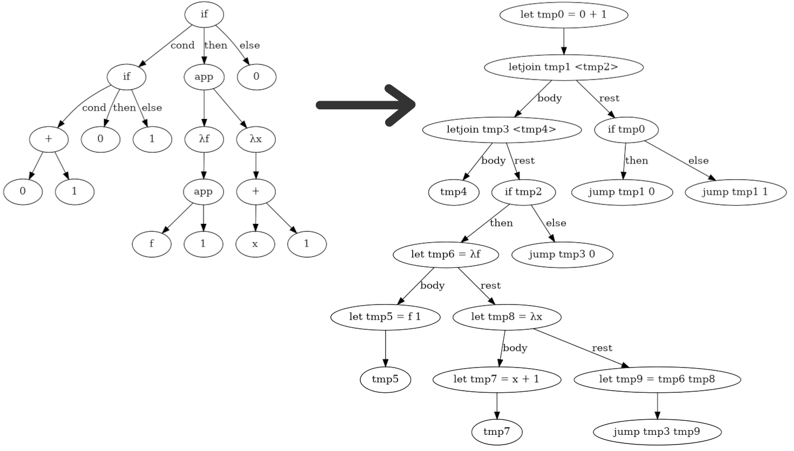

Stack safe ANF conversion in C++ using defunctionalization
==========================================================

Recently I've been interested in the idea of writing compilers for
functional programming languages in C++. C++ has the most up-to-date bindings
for generating LLVM IR, and is the most commonly used language for compiler jobs.
So I wanted to get some project experience with C++, and what better way than to
write a small compiler for a functional language in it?

The biggest issue with using C++ for this task is that compilers for functional languages
tend to heavily use recursion for rewriting trees, and with C++ we need to be careful not
to overflow the stack. While with most of the passes I can get by with visitors and explicit
heap allocated stack structures like `std::stack` or `std::vector`, the thing that
stumped me the most was ANF conversion.

What is ANF conversion? Well, one difference between a compiler for a functional language
and an imperative one is that functional compilers have higher order functions which must
be transformed away by the compiler before it can be lowered to LLVM. We also want the compiler to apply specific transformations related to functional programming languages like function uncurrying, argument flattening, etc.

This calls for another intermediate language between the abstract syntax tree and LLVM IR,
which still preserves the tree structure for nested functions, if statements, and join points (which are like basic blocks but with arguments), but otherwise disallows nested expressions. So something that is expressed as `1 + 2 * 3` in the abstract syntax tree
would be represented like:

```
let tmp1 = 2 * 3 in
let tmp2 = 1 + tmp1 in
tmp2
```

This representation is called [A-normal form](https://en.wikipedia.org/wiki/A-normal_form) or ANF for short. ANF conversion is the process of converting the abstract syntax tree into A-normal form. The image below shows the process of ANF conversion for a
expression in a language with if, lambda, apply, and binary operator expressions:



How would we implement this transformation? Lets look at a sample example for
if expressions. If we have `1 + if 0 + 1 then 1 + 2 else 2 * 3` what would the output look like?

```
let tmp0 = 0 + 1 in
letjoin tmp1 <tmp2> =
  let tmp3 = 1 + tmp2 in
  tmp3
in
if tmp0 then
  let tmp5 = 1 + 2 in
  jump tmp1 tmp5
else
  let tmp6 = 2 * 3 in
  jump tmp1 tmp6
```

The body of the join point contains the "rest" of the code that uses the value of the if expression (stored in the join point's argument `tmp2`). The
then and else expressions are recursively converted into ANF and linked to a jump expression at the end. The psuedocode for what we want this
transformation to look like is shown below:

```
result_condition = recursively convert condition expression
letjoin joinName <slot>
  [rest of the computation using slot as the value of the if expression]
in
if result_condition then
  result_then = recursively convert then expression
  jump joinName result_then
else
  result_else = recursively convert else expression
  jump joinName result_else
```

Because we have a problem where we want to expand the rest of the computation, we want to pass in a continuation into the conversion
function. The continuation will take as a parameter a value denoting the result of the expression, and return the result of ANF converting the rest of the program. This is what this looks like in C++ (`k` is a member of the `AnfConvertVisitor` class and refers to the continuation):

```cpp
std::unique_ptr<Exp> AnfConvertVisitor::operator()(ast::IfExp &exp) {
  return exp.cond->convert([&thenBranch = *exp.then, &elseBranch = *exp.els,
                            &k = k](Value condValue) {
    auto joinName = fresh();
    auto slot = fresh();
    return make(JoinExp{
        .name = joinName,
        .slot = std::optional{slot},
        .body = k(VarValue{slot}),
        .rest = make(IfExp{
            .cond = condValue,
            .thenBranch = thenBranch.convert([&joinName](Value value) {
              return make(JumpExp{joinName, std::optional{std::move(value)}});
            }),
            .elseBranch = elseBranch.convert([&joinName](Value value) {
              return make(JumpExp{joinName, std::optional{std::move(value)}});
            })})});
  });
}
```

The if else case is the hardest case to handle; the other cases are pretty easy. However, we should take a step back. Just from looking at the if else example it should be clear that the conversion is
happening recursively. We don't want this because if we pass in a larger
AST, then we can get stack overflows.

What we want to do instead is to convert this recursion into a loop. Because
all recursive uses will have to be eliminated, that includes the continuation
call since that is also recursive. This means that the higher order function
`k` will have to be eliminated through the process of defunctionalization.

Because defunctionalization is a pretty involved process, we want to do this
in a language better suited for the task. You could use any functional language with guaranteed tail call elimination like Scheme, Haskell, OCaml, etc. but for this I chose Standard ML because it doesn't have syntax sugar like do notation or let binding syntax, making it slightly easier to identify closures.

Let's start off by writing the basic recursive implementation for ANF
conversion in Standard ML:

```sml
local
  fun go exp k =
    case exp of
      L.Int i => k (Int i)
    | L.Var v => k (Var v)
    | L.Lam (v, body) =>
        let
          val body = go body Halt
          val f = fresh "f"
        in
          Fun (f, [v], body, k (Var f))
        end
    | L.App (f, x) =>
        go f (fn f =>
        go x (fn x =>
        case f of
          Var f => let val r = fresh "r" in App (r, f, [x], k (Var r)) end
        | _ => raise Fail "must apply named value"))
    | L.Bop (bop, x, y) =>
        go x (fn x =>
        go y (fn y =>
        let val r = fresh "r"
        in Bop (r, bop, x, y, k (Var r))
        end))
    | L.If (c, t, f) =>
        go c (fn c =>
          let
            val (j, p) = (fresh "j", fresh "p")
            val jump = fn p => Jump (j, SOME p)
          in
            Join (j, SOME p, k (Var p), If (c, go t jump, go f jump))
          end)
in val convert = fn exp => go exp Halt
end
```

Although we pass in a continuation `k` into the conversion function,
this conversion function is not in continuation passing style form.
In continuation passing style, all function calls are always in
tail position, or in other words, at the very end of the function.
But in this function, we call `k` and use its return value afterwards,
which means it is not called in tail position. So the first thing we need to do
is convert `go` to be in proper continuation passing style form. We do that by
having the continuation `k` itself take in a continuation for what to do
with the result ANF expression. We call this continuation `k'` and it takes
an ANF expression as a parameter and the result. Then, we thread `k'` into
the `go` function as well so that when we need to call `k` we have a `k'` ready
to pass into it.

```sml
local
  fun go (exp: L.exp) (k': exp -> exp) (k: value * (exp -> exp) -> exp) : exp =
    case exp of
      L.Int i => k (Int i, k')
    | L.Var v => k (Var v, k')
    | L.Lam (v, body) =>
        let
          val k' = fn body =>
            let val f = fresh "f"
            in k (Var f, fn rest => k' (Fun (f, [v], body, rest)))
            end
        in
          go body k' (fn (value, k') => k' (Halt value))
        end
    | L.App (f, x) =>
        go f k' (fn (f, k') =>
        go x k' (fn (x, k') =>
        case f of
          Var f =>
            let val r = fresh "r"
            in k (Var r, fn rest => k' (App (r, f, [x], rest)))
            end
        | _ => raise Fail "must apply named value"))
    | L.Bop (bop, x, y) =>
        go x k' (fn (x, k') =>
        go y k' (fn (y, k') =>
        let val r = fresh "r"
        in k (Var r, fn rest => k' (Bop (r, bop, x, y, rest)))
        end))
    | L.If (c, t, f) =>
        go c k' (fn (c, k') =>
          let
            val (j, p) = (fresh "j", fresh "p")
            val jump = fn (v, k') => k' (Jump (j, SOME v))
            val go' = fn e => fn f => go e f jump
          in
            k (Var p, fn rest =>
              go' t (fn t =>
              go' f (fn f =>
              k' (Join (j, SOME p, rest, If (c, t, f))))))
          end)
in
  val convertCPS: L.exp -> exp = fn e =>
    go e (fn a => a) (fn (v, k) => k (Halt v))
end
```

This function is completely tail recursive, but we cannot port this directly to C++. Even if
we use Clang and GCC's `musttail` attribute for tail call optimization,
that optimization can only be applied for tail calls with the exact same
type signature as the function itself, which is not the case here. So we still need to do defunctionalization.

The first step to defunctionalization is to identify the types of closures that need to be lowered. For our ANF conversion function we have two types:
`k'` which refers to closures with the type `exp -> exp`, and `k` for the type `value * (exp -> exp) -> exp`. We create two algebraic data types, `K'` for
representing closures with the type of `k'`, and `K` representing closures
with the type of `k`. We then create two functions `applyK'`, and `applyK`
that will be used in place of calling a continuation with the given arguments.
The `exp -> exp` argument to `k` is also translated to a `K'` type since we
are replacing all higher order functions with the defunctionalized version.
This is what it looks like so far, with `...` representing the parts
that haven't been filled out yet:

```sml
datatype K' =
  ...
and K =
  ...

fun go (exp: L.exp) (k': K') (k: K) : exp =
  ...
and applyK' (k' : K') (exp: exp) : exp =
  ...
and applyK (k : K) (value: value) (k': K') : exp =
  ...
```

Now we have to identify all the closures for each closure type. This means looking for all expressions in the form `fn _ =>`. Starting with `k'`, there are two closures in the `Lam` branch:

```sml
| L.Lam (v, body) =>
    let
      val k' = (* k' closure 1 *) fn body =>
        let val f = fresh "f"
        in k (Var f, (* k' closure 2 *) fn rest => k' (Fun (f, [v], body, rest)))
        end
    in
      go body k' (fn (value, k') => k' (Halt value))
    end
```

The second closure for `k'` is inside the first closure but we still have
to count it.

We also have to identify all of the free variables for each closure. Free
variables are variables that are defined outside the closure
but referred to inside
the closure. For the first closure, variables `k`, `k'`, and `v` are free
 (marked with the `(**)` in the code below):

```sml
fn body =>
  let val f = fresh "f"
  in
    (**) k (Var f, fn rest => (**) k' (Fun (f, [(**) v], body, rest)))
  end
```

For the second closure, `k'`, `f`, `v`, and `body` are free:

```sml
fn rest => (**) k' (Fun ((**) f, [(**) v], (**) body, rest))
```

For both closures, we make a data constructor for the `K'` type
that contains the free variables for the respective closures:

```sml
datatype K' =
  K'_Lam1 of {k': K', k: K, v: string}
| K'_Lam2 of {k': K', f: string, v: string, body: exp}
...
```

For the `App` branch, there is one `k'` closure with free variables
`k'`, `r`, `f`, and `x`:

```sml
fn rest => (**) k' (App ((**) r, (**) f, [(**) x], rest))
```

We add another constructor to `K'`:

```sml
| K'_App1 of {r: string, f: string, x: value, k': K'}
```

For the `Bop` branch, there is one `k'` closure with free variables
`k'`, `r`, `bop`, `x`, and `y`:

```sml
fn rest => (**) k' (Bop ((**) r, (**) bop, (**) x, (**) y, rest))
```

```sml
| K'_Bop1 of {r: string, bop: L.bop, x: value, y: value, k': K'}
```

For the `If` branch, we have three `k'` closures:

```sml
| L.If (c, t, f) =>
    go c k' (fn (c, k') =>
      let
        val (j, p) = (fresh "j", fresh "p")
        val jump = fn (v, k') => k' (Jump (j, SOME v))
        val go' = fn e => fn f => go e f jump
      in
        k (Var p, (* closure 1 *) fn rest =>
          go' t (* closure 2 *) (fn t =>
          go' f (* closure 3 *) (fn f =>
          k' (Join (j, SOME p, rest, If (c, t, f))))))
      end)
```

Note that when counting the closures for this branch, we ignore the
closures in `go'` because `go' e f` is just a alias for `go e f jump`
so the definition of `go'` is not necessary and can be inlined away.

The first closure has free variables `t`, `f`, `k'`, `j`, `p`, and `c`:

```sml
fn rest =>
  go' (**) t (fn t =>
  go' (**) f (fn f =>
  (**) k' (Join ((**) j, SOME (**) p, rest, If ((**) c, t, f)))))
```

Since `t` and `f` are shadowed here we are referring to the AST expressions,
not the converted ANF expressions.

The second closure has free variables `f`, `k'`, `j`, `p`, `rest`, and `c`:

```sml
fn t =>
  go' (**) f (fn f =>
  (**) k' (Join ((**) j, SOME (**) p, (**) rest, If ((**) c, t, f))))
```

And the third closure has free variables `k'`, `j`, `p`, `rest`, `c`, and `t`:

```sml
fn f =>
  (**) k' (Join ((**) j, SOME (**) p,  (**) rest, If ((**) c, (**) t, f)))
```

For this closure, `t` refers to the converted ANF expression instead of the AST expression.

This results in three new data constructors for `K'`:

```sml
| K'_If1 of {t: L.exp, f: L.exp, k': K', j: string, p: string, c: value}
| K'_If2 of {f: L.exp, k': K', j: string, p: string, c: value, rest: exp}
| K'_If3 of {t: exp, k': K', j: string, p: string, c: value, rest: exp}
```

Finally, `convertCPS` has a `(fn a => a)` that is passed as a `k'` closure.
Since that has no free variables, the constructor doesn't contain anything:

```sml
| K'_Convert (* Initial fn a => a passed into go *)
```

That's it for the `k'` closures. Now we have to add the data constructors
for the `k` closures. We are looking for closures that have a tuple
as a parameter now.

The first one is in the `Lam` branch with no free variables:

```sml
go body k' (fn (value, k') => k' (Halt value))
```

The `App` branch has two `k` closures with free variables `x`, `k`
for the first closure, and `f`, `k` for the second closure:

```sml
| L.App (f, x) =>
    go f k' (* closure 1 *) (fn (f, k') =>
    go x k' (* closure 2 *) (fn (x, k') =>
    case f of
      Var f =>
        let val r = fresh "r"
        in k (Var r, fn rest => k' (App (r, f, [x], rest)))
        end
    | _ => raise Fail "must apply named value"))
```

The `Bop` branch has two `k` closures with free variables `y`, `bop`, `k`
for the first closure, and `x`, `bop`, `k` for the second closure:

```sml
| L.Bop (bop, x, y) =>
    go x k' (* closure 1 *) (fn (x, k') =>
    go y k' (* closure 2 *) (fn (y, k') =>
    let val r = fresh "r"
    in k (Var r, fn rest => k' (Bop (r, bop, x, y, rest)))
    end))
```

And the `If` branch has two `k` closures with free variables `t`, `f`, `k`
for the first closure and `j` for the second closure:

```sml
| L.If (c, t, f) =>
    go c k' (* closure 1 *) (fn (c, k') =>
      let
        val (j, p) = (fresh "j", fresh "p")
        val jump = (* closure 2 *) fn (v, k') => k' (Jump (j, SOME v))
        val go' = fn e => fn f => go e f jump
      in
        k (Var p, fn rest =>
          go' t (fn t =>
          go' f (fn f =>
          k' (Join (j, SOME p, rest, If (c, t, f))))))
      end)
```

In `convertCPS`, we pass in a `(fn (v, k) => k (Halt v))` closure
which is exactly the same as the closure passed in the `Lam1` branch
so we don't need to add another constructor.

Now that we filled out the constructors for `K` and `K'` we can rewrite
the cases in `go` so that all calls to `k (a, b)` are replaced with `applyK k a b`, all calls to `k' a` are replaced with `applyK' k' a`, and all closures
passed in are replaced with the corresponding data constructor for `k` or `k'`.

```sml
fun go (exp: L.exp) (k': K') (k: K) : exp =
  case exp of
    L.Int i => applyK k (Int i) k'
  | L.Var v => applyK k (Var v) k'
  | L.Lam (v, body) => go body (K'_Lam1 {k' = k', k = k, v = v}) K_Lam1
  | L.App (f, x) => go f k' (K_App1 {x = x, k = k})
  | L.Bop (bop, x, y) => go x k' (K_Bop1 {y = y, bop = bop, k = k})
  | L.If (c, t, f) => go c k' (K_If1 {t = t, f = f, k = k})
```

We don't have to care that closures are nested in each other, we only pass in the corresponding data constructor for the topmost closure. The nested closures will be handled in the body of `applyK` or `applyK'`.

Now we do the same thing for `applyK'` and `applyK`.

Starting with `applyK'`, the closure for `K'_Convert` is `(fn a => a)`, which
becomes:

```sml
and applyK' K'_Convert exp = exp
```

The closure for the first closure in the `Lam` branch is:

```sml
fn body =>
  let val f = fresh "f"
  in k (Var f, fn rest => k' (Fun (f, [v], body, rest)))
  end
```

So the corresponding `applyK'` branch becomes:

```sml
| applyK' (K'_Lam1 {k', k, v}) body =
    let val f = fresh "f"
    in applyK k (Var f) (K'_Lam2 {k' = k', f = f, v = v, body = body})
    end
```

The nested second closure in the `Lam` branch is:

```sml
fn rest => k' (Fun (f, [v], body, rest))
```

Which becomes:

```sml
| applyK' (K'_Lam2 {k', f, v, body}) rest =
    applyK' k' (Fun (f, [v], body, rest))
```

Because each closure case only handles its own body ignoring nesting,
the total lines of code for the defunctionalized case isn't significantly
greater than the normal tail recursive one. Of course, the defunctionalized
version is much harder to understand. The final code after handling all of the
`applyK` and `applyK'` cases is shown below:

```sml
local
  fun go (exp: L.exp) (k': K') (k: K) : exp =
    case exp of
      L.Int i => applyK k (Int i) k'
    | L.Var v => applyK k (Var v) k'
    | L.Lam (v, body) => go body (K'_Lam1 {k' = k', k = k, v = v}) K_Lam1
    | L.App (f, x) => go f k' (K_App1 {x = x, k = k})
    | L.Bop (bop, x, y) => go x k' (K_Bop1 {y = y, bop = bop, k = k})
    | L.If (c, t, f) => go c k' (K_If1 {t = t, f = f, k = k})
  and applyK' K'_Convert exp = exp
    | applyK' (K'_Lam1 {k', k, v}) body =
        let val f = fresh "f"
        in applyK k (Var f) (K'_Lam2 {k' = k', f = f, v = v, body = body})
        end
    | applyK' (K'_Lam2 {k', f, v, body}) rest =
        applyK' k' (Fun (f, [v], body, rest))
    | applyK' (K'_App1 {r, f, x, k'}) rest =
        applyK' k' (App (r, f, [x], rest))
    | applyK' (K'_Bop1 {r, bop, x, y, k'}) rest =
        applyK' k' (Bop (r, bop, x, y, rest))
    | applyK' (K'_If1 {t, f, k', j, p, c}) rest =
        go t (K'_If2 {f = f, k' = k', j = j, p = p, c = c, rest = rest})
          (K_If2 {j = j})
    | applyK' (K'_If2 {f, k', j, p, c, rest}) t =
        go f (K'_If3 {t = t, k' = k', j = j, p = p, c = c, rest = rest})
          (K_If2 {j = j})
    | applyK' (K'_If3 {t, k', j, p, c, rest}) f =
        applyK' k' (Join (j, SOME p, rest, If (c, t, f)))
  and applyK K_Lam1 value k' =
        applyK' k' (Halt value)
    | applyK (K_App1 {x, k}) f k' =
        go x k' (K_App2 {f = f, k = k})
    | applyK (K_App2 {f, k}) x k' =
        (case f of
           Var f =>
             let val r = fresh "r"
             in applyK k (Var r) (K'_App1 {r = r, f = f, x = x, k' = k'})
             end
         | _ => raise Fail "must apply named value")
    | applyK (K_Bop1 {y, bop, k}) x k' =
        go y k' (K_Bop2 {x = x, bop = bop, k = k})
    | applyK (K_Bop2 {x, bop, k}) y k' =
        let
          val r = fresh "r"
        in
          applyK k (Var r) (K'_Bop1 {r = r, bop = bop, x = x, y = y, k' = k'})
        end
    | applyK (K_If1 {t, f, k}) c k' =
        let
          val (j, p) = (fresh "j", fresh "p")
        in
          applyK k (Var p) (K'_If1
            {t = t, f = f, k' = k', j = j, p = p, c = c})
        end
    | applyK (K_If2 {j}) v k' =
        applyK' k' (Jump (j, SOME v))
in val convertDefunc: L.exp -> exp = fn e => go e K'_Convert K_Lam1
end
```

There is one final thing we want to do before translating back to C++.
Let's look a the datatypes for `K` and `K'` again:

```sml
datatype K' =
  K'_Convert (* Initial fn a => a passed into go *)
| K'_Lam1 of {k': K', k: K, v: string}
| K'_Lam2 of {k': K', f: string, v: string, body: exp}
| K'_App1 of {r: string, f: string, x: value, k': K'}
| K'_Bop1 of {r: string, bop: L.bop, x: value, y: value, k': K'}
| K'_If1 of {t: L.exp, f: L.exp, k': K', j: string, p: string, c: value}
| K'_If2 of {f: L.exp, k': K', j: string, p: string, c: value, rest: exp}
| K'_If3 of {t: exp, k': K', j: string, p: string, c: value, rest: exp}
and K =
  K_Lam1
| K_App1 of {x: L.exp, k: K}
| K_App2 of {f: value, k: K}
| K_Bop1 of {y: L.exp, bop: L.bop, k: K}
| K_Bop2 of {x: value, bop: L.bop, k: K}
| K_If1 of {t: L.exp, f: L.exp, k: K}
| K_If2 of {j: string}
```

Inside almost every data constructor for `K'`, it has another value of type `K'` inside of it as a free variable. Data constructors for `K` mostly have `K` as a free variable as well. If we model this in C++, this would become a
linked-list chain of `unique_ptr`s which is not very efficient and harder to work with.

Instead, we can remove all
of the recursive free variables for `K'` and model it as a stack of frames.
The stack after popping the topmost frame off of it is the free variable `k'`
for the topmost continuation.
Pushing a frame to the stack is the same as creating a closure that wraps
the existing closure as a free variable. The cases `K'_Convert` and `K_Lam1`
are the cases where the `K` or `K'` stack is empty.

This stack method can be efficiently modeled in C++
as a dynamically resizable array like `std::vector`. Right now we will
model the stack as a list of frames but we will translate it to a vector
when converting to C++. Here are the transformed types for `K` and `K'`:

```sml
datatype K'Frame =
  K'_Lam1 of {k: K, v: string}
| K'_Lam2 of {f: string, v: string, body: exp}
| K'_App1 of {r: string, f: string, x: value}
| K'_Bop1 of {r: string, bop: L.bop, x: value, y: value}
| K'_If1 of {t: L.exp, f: L.exp, j: string, p: string, c: value}
| K'_If2 of {f: L.exp, j: string, p: string, c: value, rest: exp}
| K'_If3 of {t: exp, j: string, p: string, c: value, rest: exp}
and KFrame =
  K_App1 of {x: L.exp}
| K_App2 of {f: value}
| K_Bop1 of {y: L.exp, bop: L.bop}
| K_Bop2 of {x: value, bop: L.bop}
| K_If1 of {t: L.exp, f: L.exp}
| K_If2 of {j: string}
withtype K' = K'Frame list
and K = KFrame list
```

Now we rewrite the `go` function so that when we pass in a
closure that wraps `k` or `k'`, we push the frame with the
non-recursive free variables to the stack. So something like
`K'_Lam1 {k' = k', k = k, v = v}` becomes `K'_Lam1 {k = k, v = v} :: k'`:

```sml
fun go (exp: L.exp) (k': K') (k: K) : exp =
  case exp of
    L.Int i => applyK k (Int i) k'
  | L.Var v => applyK k (Var v) k'
  | L.Lam (v, body) => go body (K'_Lam1 {k = k, v = v} :: k') []
  | L.App (f, x) => go f k' (K_App1 {x = x} :: k)
  | L.Bop (bop, x, y) => go x k' (K_Bop1 {y = y, bop = bop} :: k)
  | L.If (c, t, f) => go c k' (K_If1 {t = t, f = f} :: k)
```

`[]` is substituted for `K_Lam1` and `K'_Convert`.

When rewriting the `applyK` and `applyK'` functions, we destruct the
`K` or `K'` stack and the rest of the list is the free variable for
`k` or `k'`. So something like `K'_Lam2 {k', f, v, body}` becomes
`K'_Lam2 {f, v, body} :: k'` when pattern matching:

```sml
and applyK' [] (exp: exp) = exp
  | applyK' (K'_Lam1 {k, v} :: k') body =
      let val f = fresh "f"
      in applyK k (Var f) (K'_Lam2 {f = f, v = v, body = body} :: k')
      end
  | applyK' (K'_Lam2 {f, v, body} :: k') rest =
      applyK' k' (Fun (f, [v], body, rest))
  | applyK' (K'_App1 {r, f, x} :: k') rest =
      applyK' k' (App (r, f, [x], rest))
  | applyK' (K'_Bop1 {r, bop, x, y} :: k') rest =
      applyK' k' (Bop (r, bop, x, y, rest))
  | applyK' (K'_If1 {t, f, j, p, c} :: k') rest =
      go t (K'_If2 {f = f, j = j, p = p, c = c, rest = rest} :: k')
        [K_If2 {j = j}]
  | applyK' (K'_If2 {f, j, p, c, rest} :: k') t =
      go f (K'_If3 {t = t, j = j, p = p, c = c, rest = rest} :: k')
        [K_If2 {j = j}]
  | applyK' (K'_If3 {t, j, p, c, rest} :: k') f =
      applyK' k' (Join (j, SOME p, rest, If (c, t, f)))
and applyK [] value k' =
      applyK' k' (Halt value)
  | applyK (K_App1 {x} :: k) f k' =
      go x k' (K_App2 {f = f} :: k)
  | applyK (K_App2 {f} :: k) x k' =
      (case f of
         Var f =>
           let val r = fresh "r"
           in applyK k (Var r) (K'_App1 {r = r, f = f, x = x} :: k')
           end
       | _ => raise Fail "must apply named value")
  | applyK (K_Bop1 {y, bop} :: k) x k' =
      go y k' (K_Bop2 {x = x, bop = bop} :: k)
  | applyK (K_Bop2 {x, bop} :: k) y k' =
      let val r = fresh "r"
      in applyK k (Var r) (K'_Bop1 {r = r, bop = bop, x = x, y = y} :: k')
      end
  | applyK (K_If1 {t, f} :: k) c k' =
      let val (j, p) = (fresh "j", fresh "p")
      in applyK k (Var p) (K'_If1 {t = t, f = f, j = j, p = p, c = c} :: k')
      end
  | applyK (K_If2 {j} :: _) v k' =
      applyK' k' (Jump (j, SOME v))
```

Finally, `convertDefunc` becomes `val convertDefunc: L.exp -> exp = fn e => go e [] []` since it is called with both stacks empty initially.

